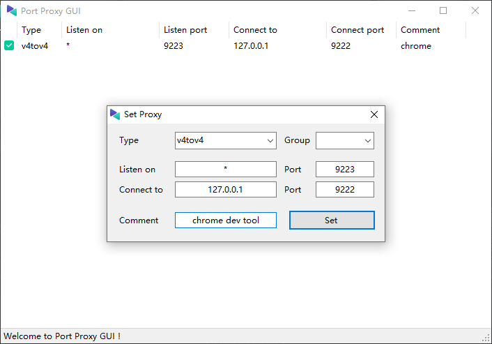

# Playwright REST API 工具

这个项目提供了一个 REST API 接口,用于执行 Playwright 脚本并返回 JSON 格式的结果。同时,它还支持将 JSON 转换为 Playwright 脚本。

## 功能特性

- 通过 REST API 调用 Playwright 脚本
- 将 Playwright 脚本执行结果以 JSON 格式返回
- 支持 JSON 转换为 Playwright 脚本

## 快速启动

```bash
$ npm i
$ npm run dev
$ npm run test
```

```bash
# 安装 playwright
pip3 install playwright
# 安装默认浏览器
playwright install
playwright install --help
```

### 生成脚本

```
curl -X 'POST' \
  'http://127.0.0.1:7001/playwrght/v1/generate' \
  -H 'accept: */*' \
  -H 'Content-Type: application/json' \
  -d '{
    "title": "baidu",
    "steps": [
        {
            "type": "setLaunchOptions",
            "value": "{\"headless\": false}"
        },
        {
            "type": "launch"
        },
        {
            "type": "setViewport",
            "width": 935,
            "height": 989,
            "deviceScaleFactor": 1,
            "isMobile": false,
            "hasTouch": false,
            "isLandscape": false
        },
        {
            "type": "navigate",
            "url": "https://baidu.com"
        },
        {
            "type": "sleep",
            "value": "3000"
        },
        {
            "type": "fill",
            "value": "abc@example.com",
            "selectors": [
                [
                    "#kw"
                ]
            ],
            "target": "main"
        },
        {
            "type": "sleep",
            "value": "3000"
        },
        {
            "type": "function",
            "value": "alert(\"hello world\")"
        },
        {
            "type": "pageClose"
        },
        {
            "type": "browserClose"
        }
    ]
}'
```

## API 文档

http://127.0.0.1:7001/swagger-ui/index.html

## TODO

- [x] 🏁 支持 devtool 协议
- [ ] 🚧 分布式调度 chrome

## 注意事项

1. devtool 只支持本地 IP 127.0.0.1,localhost 访问，所以在分布式调用的时候需要用到流量转发，~~这里在 windows 平台上推荐使用 [https://github.com/zmjack/PortProxyGUI](https://github.com/zmjack/PortProxyGUI)~~ 使用项目目录下 `port_forward_manager.bat`

   1.1 设置 chrome 快捷方式开启远程调试后 `--remote-debugging-port=9222`

   

   1.2 使用 PortProxyGUI 将 9223 的流量转发到 9222

   

2. 添加 chrome 守护，执行 `chome_daemon.bat`,输入 chrome 执行地址，守护间隔，远程调试端口

## 项目结构

```
├─playwright-report # 测试报告
├─shell #脚本
│  ├─build.sh # 编译脚本
│  ├─chome_daemon.bat # chrome 远程调试守护
│  └─port_forward_manager.bat # 端口转发工具
├─src
│  ├─common
│  ├─config
│  ├─controller
│  ├─core
│  │  └─json-to-palywright # json 转脚本
│  ├─error
│  ├─filter
│  ├─middleware
│  ├─mock
│  ├─resources # 资源文件夹
│  │  └─playwright # 脚本根目录
│  │      └─getBaiduTitle # 脚本ID
│  │          └─V1 # 脚本版本号
│  └─service
│      └─impl
├─test
│  ├─controller
│  └─playwright
├─test-results
└─view # 视图层
```
